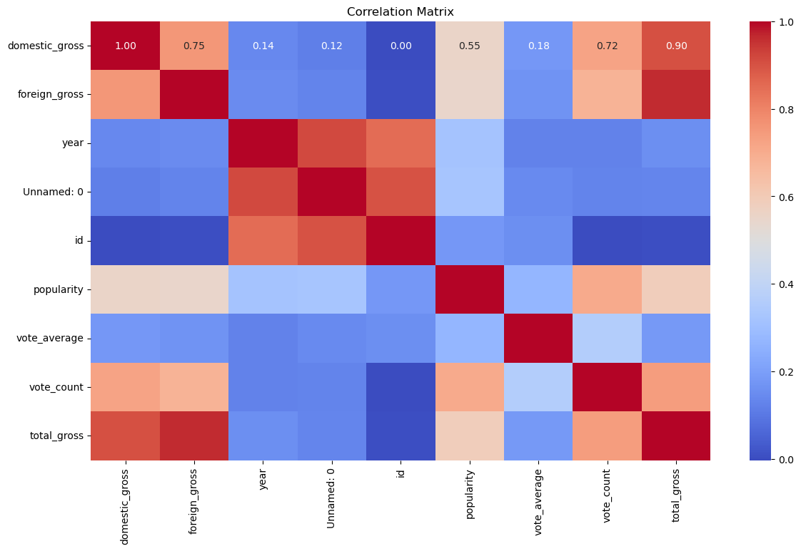
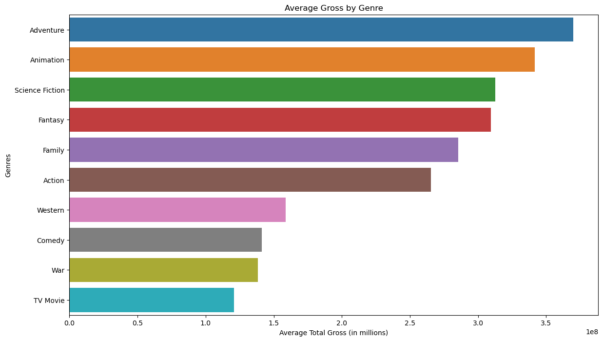
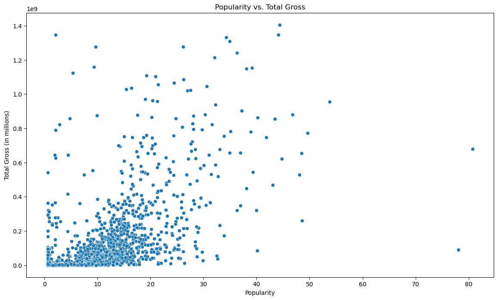

# Microsoft Movie Studio Analysis

## Problem Statement
Microsoft plans to launch a new movie studio to compete in the original video content market. However, they lack expertise in film production and need data-driven insights to make informed decisions. This project aims to analyze box office performance and identify key factors contributing to movie success. By leveraging datasets from Box Office Mojo and TMDb, the goal is to determine which genres, budget allocations, and marketing strategies are most effective. These insights will guide Microsoft's content creation strategy, ensuring the new studio produces commercially successful films.

## Main objectives 
The main objective of this project  is to identify prevalent box office trends and audience preferences across genres, providing strategic direction for Microsoft's new movie studio to create compelling, commercially successful films that resonate with audiences and differentiate the brand in the market.

## Specific objectives 
Certainly! Here are the specific objectives;

1. Identifying  the top-performing genres based on domestic and international gross revenues.
2. Determining  the correlation between budget, popularity, and total gross revenue.
3. Analyzing  audience engagement metrics such as vote count and popularity to understand their impact on box office performance.
4. Create visualizations to effectively communicate key findings and insights to stakeholders.
5. Use these visualizations to support strategic decision-making for the new movie studio.
6. Generating  actionable insights on which genres and types of films to prioritize.
7. To Offer recommendations on optimal budget allocation, marketing strategies, and audience engagement techniques.
8. Suggesting  strategies for Microsoft’s new movie studio to enable them to maximize revenue and market share.

## Datasets
The datasets that have been used in this project include ;
- **Box Office Mojo**
- **TMDb**
You might as why this two datasets and here is why;
1. The datasets provide comprehensive Insights:
For Box Office Mojo: It provides a detailed financial performance data (domestic and foreign gross).
The TMDb: It adds rich movie metadata (budget, popularity, vote average, vote count, genres).

2. Combining financial and descriptive data enables a more accurate and holistic analysis of factors driving movie success.

3.Integration allows analysis of both quantitative metrics (gross revenue, budget) and qualitative metrics (popularity, audience ratings).

4. Lastly the two  provide a multi-faceted view, leading to comprehensive strategic insights for Microsoft’s new movie studio.

By leveraging both datasets, the analysis gains depth and breadth, ensuring well-rounded and data-driven recommendations for Microsoft’s movie studio.

### Data Preparation/Cleaning
In preparing the data for analysis , several steps were taken to ensure the data's quality, relevance, and reliability. Here's an overview of the data preparation process and the reasoning behind the decisions made:

1.Handling Missing Values
In Box Office Mojo-  rows with missing 'studio' values were dropped to ensure completeness.
In TMDb: rows with missing values in critical columns like 'vote_average', 'vote_count', and 'genres' were dropped. 

2. Converting Data Types
financial columns such as 'domestic_gross' and 'foreign_gross' were converted from strings to numeric data types for accurate calculations and analysis.

3. Handling Non-Numeric Data
Ensured that only numeric columns were used for correlation and regression analysis to avoid errors and improve model performance.

4. Merging the Datasets 
 merging was done  on the 'title' column to combine financial performanace data with the movie metadata.

## Data Analysis and Visualizations
In this bit the focus was more on descriptive analysis rather than building predictive models. Here's an outline of the approach taken for analyzing the data: The analysis focused on identifying attributes associated with box office and TMDb success, aligning with the business problem of guiding Microsoft's movie studio in selecting film types.

Analysis Approach:
1. Exploratory Data Analysis (EDA): Utilized statistical and visualization techniques to understand the distribution of variables, identify trends, and uncover patterns in successful movies.

2. Correlation and Patterns: Investigated relations among variables to identify relationships that contribute to a movie's success .

Here is a breakdown and key Insights from the Correlation Matrix

For the Domestic and Foreign Gross Correlation the coefficient is 0.75
Insight: High correlation indicates that movies that perform well domestically also tend to perform well internationally. This highlights the importance of producing content with broad appeal.

For the Total Gross and Domestic Gross the coefficient is 0.90
Insight: Very strong correlation, showing that domestic performance is a significant component of total gross. This suggests focusing on strategies that enhance domestic market performance.

The heatmap above shows the correlation between various numerical variables in the dataset. Notably, domestic gross and total gross have a strong positive correlation, indicating the importance of domestic market performance in overall success.

### Visualizations
## Evaluation of the Top performing movies
The bar plot below displays the average total gross revenue (in millions) for movies across various genres.
Each bar represents a genre, with the length of the bar indicating the average total gross for movies within that genre. 

From the plot here are the key insights:

**Adventure**- This genre leads in average gross revenue, indicating high market demand and profitability.
**Animation**- Close behind Adventure, Animation movies also show significant revenue potential.
**Science Fiction and Fantasy**- These genres follow, suggesting strong interest and financial returns.
**Family and Action**- These genres are also prominent, highlighting their appeal to wide audiences.
Western, Comedy, War, and TV Movie: These genres, while still profitable, show relatively lower average gross revenues.

## Popularity vs. Total Gross Scatter plot
The scatter plot below illustrates the relationship between a movie's popularity and its total gross revenue.
Each dot represents a movie, with the x-axis showing its popularity score and the y-axis showing its total gross revenue (in millions).

From the plot here are the key Insights:

**Positive Correlation**- There's a positive trend, indicating that higher popularity scores generally correlate with higher total gross revenues.
**Wide Distribution**- Movies with lower popularity scores have a wide range of total gross values, suggesting other factors also play significant roles in determining total revenue.
**Outliers**- Several movies with very high total gross revenues have moderate popularity scores, indicating strong box office performance despite not being the most popular.

## Insights and Recommendations
### Insights
From the analysis these are some of the insights 

**On genre performance**
Adventure and Animation took the  lead in average gross revenue, suggesting high market demand and profitability.
Science Fiction and Fantasy- also showed  significant revenue potential, indicating strong audience interest.

**In terms of popularity and revenue**
Positive Correlation- Higher popularity scores generally correlate with higher total gross revenues, emphasizing the importance of marketing and audience engagement.
Wide Distribution- Movies with lower popularity scores have a wide range of total gross values, highlighting the influence of other factors.

**Domestic and International Success**
Strong Correlation-  Domestic gross strongly correlated with total gross, indicating that successful domestic performance is crucial for overall success.

We went further to identify the key predictors which are Budget and Popularity. The two were identified as significant predictors of total gross, emphasizing the importance of strategic budget allocation and marketing efforts.

### Recommendations
As a reult of my work I would recommend Microsoft to implement the following steps as they would aid in Microsoft successful venture into creation of video content

1. **Focusing  on High-Grossing Genres**
Microsoft should prioritize producing Adventure, Animation, Science Fiction, and Fantasy films to maximize revenue potential.

2. **Enhancing Marketing Efforts**
They should Invest in marketing strategies to boost movie popularity, as higher popularity generally leads to higher gross revenues.
 they should also utilize social media campaigns, influencer partnerships, and interactive promotions to engage audiences.

3. **Strategic Budget Allocation**
From our analysis we have seen that the higher the production budget , the higher the worldwide gross which is the earnings from the video content therefore it is important for Microsoft to consider strategic investments in or acquisitions of larger studios or even content from them to capitalize on their existing success and market presence and to build a diverse and successful movie portfolio .

4. **Engage Domestic and International Markets**
Microsoft should also focus  on domestic market performance as it strongly correlates with overall success.They should also develop international marketing strategies to tap into global audiences and maximize foreign gross revenues.

5. **Monitoring  Market Trends**
Microsoft should continuously analyze market trends and audience preferences to adapt strategies and maintain competitive advantage and also to make informed decisions and adapt to its strategies for sustained success as things change and the preferences evolve with time.

## Limitations
Some of the reasons my analysis might not fully solve the business problem are highlighted below:

1. **Data Completeness** 
In the dataset some movies may have incomplete data for key variables such as budget, vote counts, or popularity, potentially skewing the analysis.

Also reliance on Box Office Mojo and TMDb means the analysis is limited to the data available from these sources, which may not capture all relevant information.

2. **Correlation vs. Causation**
High correlation between variables (e.g., popularity and total gross) does not imply causation. Other underlying factors might influence these relationships and should also been put into considaration before any decisions are made 

3. **Generalizability**
On Genre and Market Trends The success of certain genres might be influenced by current trends, which can change over time, affecting the generalizability of the findings.

4. **External Factors**
Not putting into considearions Factors such as economic conditions, competition, and marketing effectiveness can impact movie performance but are not captured in the datasets used.

5.**Audience Preferences**
Dynamic Preferences: Audience tastes and preferences evolve, making it challenging to predict long-term success based on historical data alone.

## Next Steps
To address these limitations, consider:

1. Continuously updating the datasets and models with new data.

2. Incorporating additional data sources for a more comprehensive analysis.

3. Using a combination of qualitative and quantitative methods to understand the factors influencing movie success.

## License
This project is licensed under the MIT License - see the [LICENSE](LICENSE) file for details.

## Acknowledgements
- [Box Office Mojo](https://www.boxofficemojo.com/)
- [TMDb](https://www.themoviedb.org/)

## Questions
If you have any questions or would like to discuss further, please open an issue or contact me directly.
